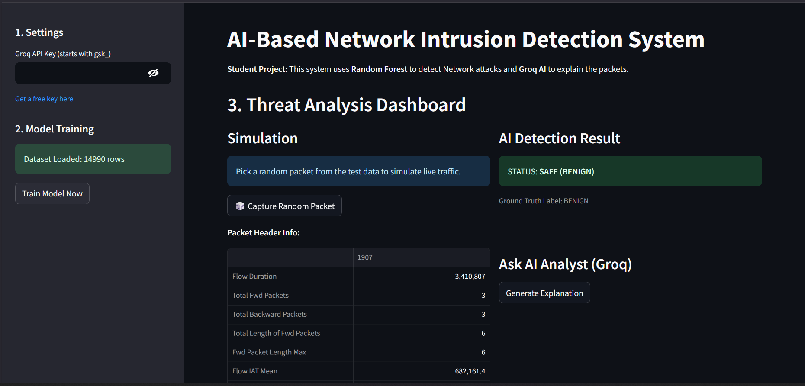

# 🛡️ AI-Based Network Intrusion Detection System (NIDS)

An **AI-powered Network Intrusion Detection System** that uses **Machine Learning (Random Forest)** and **Generative AI (Grok)** to detect and explain **DDoS attacks** from real network traffic data.  
Built as a **student cybersecurity project** with strong relevance to **SOC Analyst and Blue Team roles**.

---

## 📌 Project Overview

Traditional Network Intrusion Detection Systems can detect malicious traffic but often fail to explain *why* an alert was triggered.  
This project enhances intrusion detection by combining:

- Machine learning–based attack detection  
- Generative AI–based reasoning and explanation  
- Interactive SOC-style packet analysis  

The system classifies network packets as **BENIGN** or **DDoS** and optionally generates **human-readable explanations** using a Large Language Model (LLM).

---

## 📸 Project Dashboard Preview

<p align="center">
  
</p>

<p align="center"><b>AI-Based NIDS Threat Analysis Dashboard</b></p>

---

## ✨ Key Features

- 🧠 Random Forest–based intrusion detection  
- 🧪 Real-world dataset (CIC-IDS2017 – DDoS traffic)  
- 🤖 Generative AI explanations using Grok (optional)  
- 📊 SOC-style random packet simulation  
- 🌐 Interactive Streamlit web application  
- 🎓 Beginner-friendly and educational  

---

## 🏗️ Architecture (High Level)

1. Network traffic dataset loaded  
2. Feature preprocessing and train/test split  
3. Random Forest model training  
4. Packet-level prediction (BENIGN / DDoS)  
5. Optional AI explanation using LLM  
6. Results displayed via Streamlit UI  

---

## 🚀 Getting Started

### Clone the Repository
```bash
git clone https://github.com/your-username/ai-based-nids.git
cd ai-based-nids
 ``` 
Dataset Setup (Important)

The dataset is provided as a ZIP file due to GitHub size limits.

Unzip the dataset file

Place the extracted CSV in the same folder as app.py

Expected structure:

ai-based-nids/

├── app.py

├── requirements.txt

├── README.md

├── Friday-WorkingHours-Afternoon-DDos.pcap_ISCX.csv

└── nids-dashboard.png

⚠️ The application will not run unless the CSV file is extracted and placed correctly.

Install Dependencies

pip install -r requirements.txt

Run the Application

streamlit run app.py

🧪 How to Use

(Optional) Enter your Grok API key in the sidebar

Click Analyze Random Network Packet

View:

Prediction result (BENIGN or DDoS)

Model confidence

Ground truth label

Click Explain with AI to receive a human-readable explanation (if API key is provided)

📂 Project Structure

ai-based-nids/

├── app.py

├── requirements.txt

├── README.md

├── Friday-WorkingHours-Afternoon-DDos.pcap_ISCX.csv

└── nids-dashboard.png

🛠️ Technologies Used

Python

Streamlit

Scikit-learn

Pandas

NumPy

Random Forest Classifier

Generative AI (Grok API)

📈 Use Cases

SOC Analyst training project

Cybersecurity academic submission

AI-assisted security analysis demonstration

Blue Team learning lab

Resume / GitHub portfolio project

🎯 Learning Outcomes

Understand intrusion detection workflows

Apply machine learning to network security

Interpret network traffic–based attacks

Use LLMs to enhance SOC investigations

🚧 Future Improvements

Multi-attack classification (Port Scan, Brute Force, Botnet)

Live network traffic capture

Model performance dashboard

MITRE ATT&CK technique mapping

SIEM integration (Splunk / Microsoft Sentinel style)

⚠️ Disclaimer

This project is intended strictly for educational and research purposes and is not suitable for production deployment.
